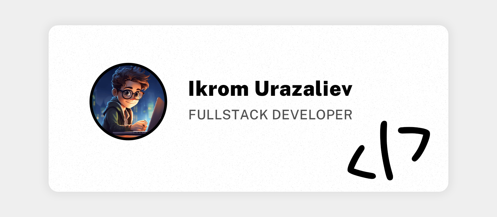

# Hello 👋

My name is Ikrom Urazaliyev and I am **front-end developer** from Uzbekistan. I have experience building **SPAs** and **JAMstack** sites. I am an avid learner and diligent developer who enjoy working in multidisciplinary teams.

## Portfolio

<a href="https://www.linkedin.com/in/ikromui/">linkedin</a> • 
<a href="CV">portfolio</a>

## GitHub Stats 

## Tech Skills

  
  
  
  
  
  
  
  
  
  
  
  
  
  
  
  
  
  
  

###
